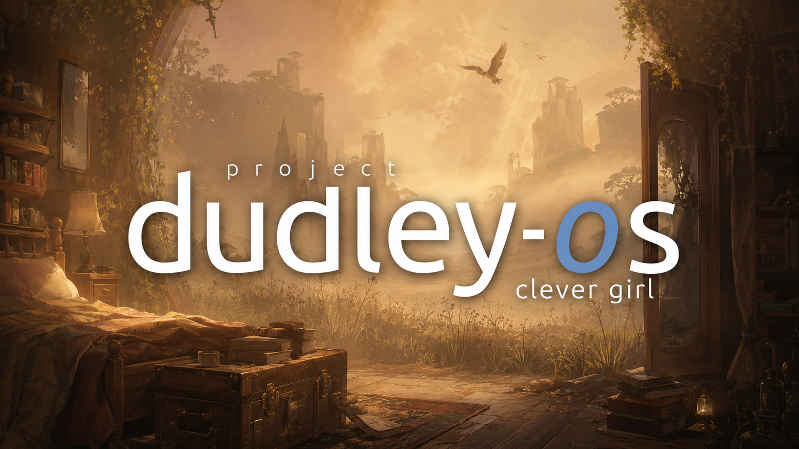
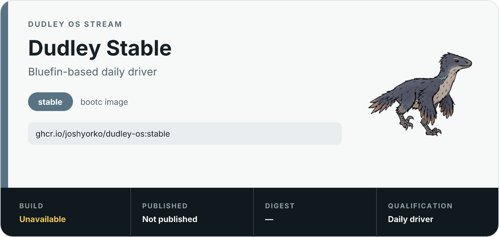
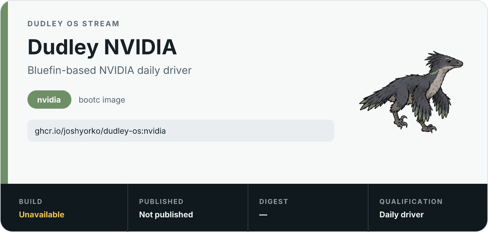
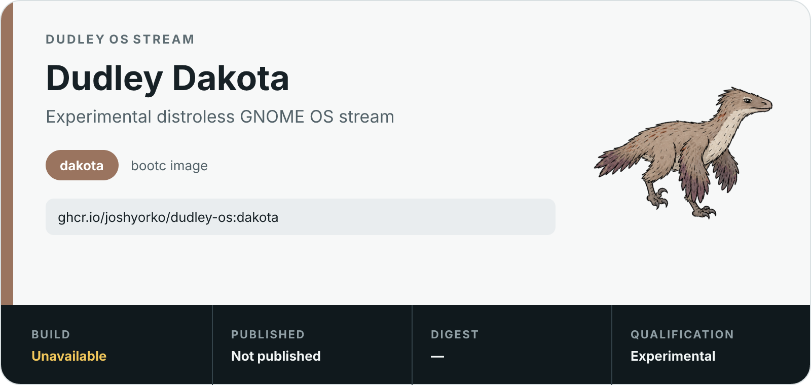

# dudley-os

Dudley is Josh's personal [Project Bluefin](https://projectbluefin.io) variant: a bootc operating-system image that keeps Bluefin's desktop and userland contract while adding Dudley-specific defaults, tools, and release streams.

<p align="center">
  <a href="static/img/dudley-os-clever-girl-golden-bedroom.png">
    
  </a>
</p>

> **Upstream foundation:** Dudley is built on [Project Bluefin](https://projectbluefin.io) and its [documentation](https://docs.projectbluefin.io), published with [Project Bluefin Actions](https://github.com/projectbluefin/actions), and grounded in the [Universal Blue](https://universal-blue.org) and [bootc](https://containers.github.io/bootc/) ecosystems.

## Choose a stream

Stable is the general daily-driver stream.

<picture>
  <source media="(prefers-color-scheme: dark)" srcset="static/img/cards/stable-dark.png">
  
</picture>

```bash
sudo bootc switch ghcr.io/joshyorko/dudley-os:stable --enforce-container-sigpolicy
```

NVIDIA is the daily-driver stream for systems that need Project Bluefin's NVIDIA runtime.

<picture>
  <source media="(prefers-color-scheme: dark)" srcset="static/img/cards/nvidia-dark.png">
  
</picture>

```bash
sudo bootc switch ghcr.io/joshyorko/dudley-os:nvidia --enforce-container-sigpolicy
```

Dakota is experimental. It publishes matching `dakota` and `dakota-nvidia` images for the offline installer and still requires boot, update, and rollback qualification, plus a completed installer test, before daily-driver use.

<picture>
  <source media="(prefers-color-scheme: dark)" srcset="static/img/cards/dakota-dark.png">
  
</picture>

```bash
sudo bootc switch ghcr.io/joshyorko/dudley-os:dakota --enforce-container-sigpolicy
```

## Daily operation

Inspect the active deployment, stage an update, and reboot into it:

```bash
bootc status
sudo bootc upgrade
sudo systemctl reboot
```

If the new deployment is unsuitable, apply the previous deployment:

```bash
sudo bootc rollback --apply
```

See the [operator runbook](docs/operations.md) for stream switching, VM workflows, and image verification. Project Bluefin's [documentation](https://docs.projectbluefin.io) is the source for inherited upstream behavior.

## What Dudley adds

Stable and NVIDIA add the Dudley product layer while retaining their Project Bluefin bases:

- shared DSB defaults and Dudley payload from `dsb-common`
- Dudley wallpapers, runtime Brewfiles, Flatpak declarations, VS Code payload, hooks, and recipes
- DX-style container, virtualization, and developer runtime additions
- Google Chrome installed into the image
- Dudley identity, metadata, validation, publishing, and local product glue

Dakota uses an allowlisted, distribution-neutral overlay. It keeps Podman and
provides a `docker` compatibility command backed by Podman, uses Ghostty instead
of Ptyxis, and bakes native Google Chrome into the image from Google's
signature-verified RPM payload without adding RPM or DNF to the final image. Run
`ujust dudley-dakota` once to initialize Homebrew, install the Dudley IDE bundle
(including VS Code Insiders), and finish the portable developer setup. Dakota
preserves the terminal and Zsh configuration supplied by its base/user setup.
Run `ujust dudley tools` to install every formula and cask currently published
by `joshyorko/tools`.
The Fedora/RPM/DNF, Docker daemon, and libvirt host payload remain excluded.

*Last updated: 2026-08-01*

## Architecture

| Layer | Responsibility |
| --- | --- |
| Project Bluefin | Base images, desktop and userland contract, bootc integration, and shared build/publish actions |
| `dsb-common` | Shared DSB defaults plus Dudley wallpapers, Brewfiles, Flatpak declarations, VS Code payload, hooks, and recipes |
| `dudley-os` | Stream assembly, DX-style runtime additions, Chrome image install, final metadata, validation, publishing, and local product glue |

Stable and NVIDIA are assembled in this order:

1. Project Bluefin stream base
2. `dsb-common/shared`
3. `dsb-common/dudley`
4. local `dudley-os` assembly

Dakota uses the same ownership boundaries but applies only its allowlisted file overlay to the Project Bluefin Dakota base. Detailed change-placement and stream-input guidance lives in [Maintenance and ownership](docs/maintenance.md).

## Build, trust, and release

Renovate pins image and action dependencies by digest. Project Bluefin Actions handles runner setup, preflight, image push, keyless signing, and GitHub provenance. Pushes to `main` publish Stable, NVIDIA, Dakota, and Dakota NVIDIA. CI SBOM publication is disabled.

Verify the published Stable image against this repository's GitHub Actions OIDC identity:

```bash
cosign verify \
  --certificate-identity-regexp "https://github.com/joshyorko/dudley-os/" \
  --certificate-oidc-issuer "https://token.actions.githubusercontent.com" \
  ghcr.io/joshyorko/dudley-os:stable
```

## Local verification

Run the repository checks before opening a pull request:

```bash
npm ci
just test
npm run test:cards
npm run cards:check
```

Build and exercise a local VM when an image-level change needs runtime proof:

```bash
just build
just build-qcow2
just run-vm-qcow2
```

Build the experimental Dakota container image locally:

```bash
just build-dakota
```

The matching offline installer is owned by
[`joshyorko/dudley-iso`](https://github.com/joshyorko/dudley-iso) and is built
there with `just iso-sd-boot dudley`. Dakota still requires boot, install,
update, and rollback qualification before daily-driver use.

## Repository map

| Path | Purpose |
| --- | --- |
| `Containerfile` | Stable and NVIDIA final image assembly |
| `Containerfile.dakota` | Experimental Dakota allowlisted overlay |
| `build/` | Build-time product assembly and validation |
| `custom/` | Dudley-only product files and ujust wiring |
| `.github/workflows/` | Stream validation and publication |
| `tests/` | Image, workflow, and documentation contracts |
| `docs/` | Operator, maintenance, and historical detail |

Supporting documents:

- [Operator runbook](docs/operations.md)
- [Maintenance and ownership](docs/maintenance.md)
- [Legacy migration record](docs/history/dudleys-second-bedroom-migration.md)

## Upstream and supporting projects

- [Project Bluefin](https://projectbluefin.io) provides Dudley's base images and inherited desktop experience.
- [Project Bluefin documentation](https://docs.projectbluefin.io) documents the upstream operating model.
- [Project Bluefin Actions](https://github.com/projectbluefin/actions) provides Dudley's shared build, publish, signing, and provenance actions.
- [`dsb-common`](https://github.com/joshyorko/dsb-common) owns reusable DSB and Dudley payload.
- [Universal Blue](https://universal-blue.org) is the broader image ecosystem.
- [bootc](https://containers.github.io/bootc/) provides the transactional image-based operating-system model.
